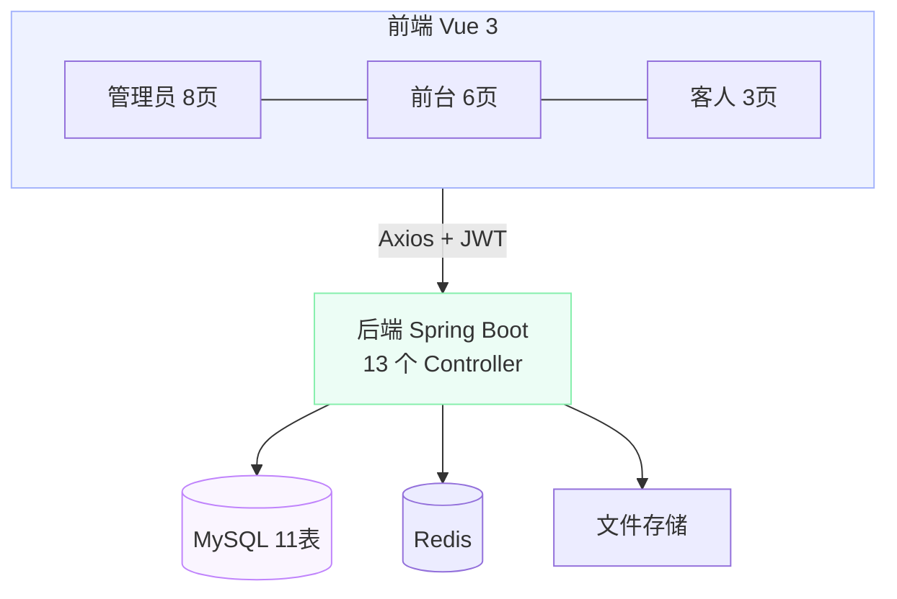

# 酒店客房管理系统开发记录

## 项目概述

本项目是一个连锁酒店客房管理系统，采用前后端分离架构，支持多门店运营，覆盖了从客人在线预订、前台入住办理、退房结算到管理员经营分析的完整业务链路。系统按管理员、前台、客人三种角色划分权限，不同角色登录后进入不同的操作界面，各自只能看到与自身职责相关的功能。

## 技术栈

### 后端

- **框架**: Spring Boot 3.2.0
- **ORM**: MyBatis 3.0.3
- **数据库**: MySQL 8.0
- **认证**: JWT（jjwt 0.12.3）
- **构建**: Maven

### 前端

- **框架**: Vue 3.4 + Vite 5.0
- **UI 组件库**: Element Plus 2.4
- **路由**: Vue Router 4.2
- **HTTP 客户端**: Axios 1.6

## 系统架构



## 三种角色与权限设计

系统的核心设计之一是角色隔离。登录时后端通过 JWT 生成包含角色信息的 Token，前端路由守卫根据角色跳转到不同模块，后端拦截器在每个 API 请求中校验角色和门店归属。

| 角色 | 登录方式 | 核心功能 |
|------|----------|----------|
| 管理员 | 用户名+密码 | 全系统管理、数据分析、门店/员工/房型管理、图片上传 |
| 前台 | 用户名+密码 | 客房状态查看、预订/入住/退房办理、账单开具 |
| 客人 | 手机号+密码 | 房间预订、订单查询、个人信息管理 |

前端路由守卫的实现逻辑是：未登录用户强制跳转到登录页，已登录用户访问登录页时根据角色自动重定向到对应模块。后端的 JwtInterceptor 拦截所有 `/api/**` 请求（排除登录和注册接口），从 Token 中解析出用户角色和门店 ID，注入到请求上下文中，供后续业务逻辑使用。

## 连锁门店管理

系统从设计之初就考虑了多门店场景。stores 表存储门店基本信息（名称、地址、电话、描述、图片），其他所有业务数据都通过 `store_id` 外键关联到具体门店。

前台员工登录后，系统根据其 `store_id` 自动过滤数据——只能看到自己门店的房间、预订和入住记录。如果尝试通过 API 访问其他门店的数据，后端会返回 403 权限不足。管理员角色不受此限制，可以查看所有门店的汇总数据。

## 核心功能模块

### 1. 客房管理

客房管理涉及三张表：stores（门店）、room_types（房型）、rooms（房间）。一个门店下有多种房型（标准间、豪华间、行政套房、家庭套房、总统套房等），每种房型下有具体房间。

房间状态使用枚举值管理：可售、已预订、已入住、清扫中、维修中。前台端的客房状态页面以色块视图展示各房间的当前状态，一目了然。管理员和前台都可以修改房间状态，例如保洁完成后将"清扫中"改为"可售"。

房型和门店都支持图片上传。管理员上传图片后，前端实时预览，更新时自动删除旧文件，删除门店或房型时同步清理图片目录。上传的文件存储在后端 `uploads/` 目录下，通过 Spring MVC 的静态资源映射对外提供访问。

### 2. 预订管理

客人通过客人端浏览门店和房型，选择入住日期、离店日期和房间数量后提交预订。预订创建后状态为"待确认"，前台确认后变为"已确认"，客人实际入住后变为"已入住"，也可以在任意阶段取消。

预订表（reservations）记录了客人、房型、入住离店日期、预订间数、实际入住人数、押金、备注等信息。预订时可以选择指定具体房间（room_id），也可以只选房型由前台分配。

### 3. 入住与退房

入住登记时，前台关联预订记录，选择具体房间，系统自动记录入住时间和操作员工。退房时触发结算流程：房费按入住天数计算，加上客人在住期间的其他消费（餐饮、迷你吧、洗衣服务等），扣除已付押金，得出实际应付金额。

入住表（checkins）通过 `reservation_id` 外键关联预订，支持散客直接入住（无预订的情况）。

### 4. 消费管理

系统内置了消费项目目录（consumption_items），预设了早餐、午餐、晚餐、迷你吧、洗衣服务、叫醒服务、会议室等项目，管理员可以自行增减。客人入住期间产生的消费通过消费记录表（consumption）关联到具体入住记录，退房时自动汇总计入账单。

### 5. 账单与发票

退房结算时自动生成账单（bills），记录房费、其他费用、总费用、押金抵扣、实际支付金额和支付方式（现金、刷卡、微信、支付宝）。账单支持发票管理，记录发票状态和发票号（A 开头流水号）。

### 6. 经营数据分析

管理员专享的数据分析模块包含四个维度：

- **入住率概览**：实时统计各门店的总房间数、已入住数、入住率
- **门店入住率对比**：横向对比各门店的入住情况
- **营收分析**：按日期范围查询营收趋势，支持按门店筛选，展示每日营收变化图表
- **账单报表**：按日期范围导出详细账单明细，支持多维度筛选

所有统计接口都做了权限校验，只有管理员角色才能访问。

### 7. 员工管理

管理员可以对员工账号进行增删改查，分配角色（管理员、前台）和所属门店。员工登录后系统根据角色和门店自动限制可访问的数据范围。

## 数据库设计

系统共 11 张核心表，关系如下（Chen 记法）：


### 核心表结构

```sql
-- 门店表
CREATE TABLE stores (
  store_id INT PRIMARY KEY AUTO_INCREMENT,
  store_name VARCHAR(100) NOT NULL,
  address VARCHAR(255) NOT NULL,
  phone VARCHAR(20) NOT NULL,
  description TEXT,
  image VARCHAR(500),
  created_at DATETIME DEFAULT CURRENT_TIMESTAMP
);

-- 客房类型表
CREATE TABLE room_types (
  type_id INT PRIMARY KEY AUTO_INCREMENT,
  type_name VARCHAR(50) NOT NULL,
  description TEXT,
  base_price DECIMAL(10,2) NOT NULL,
  max_occupancy INT NOT NULL,
  store_id INT NOT NULL,
  image VARCHAR(500),
  FOREIGN KEY (store_id) REFERENCES stores(store_id)
);

-- 客房表
CREATE TABLE rooms (
  room_id INT PRIMARY KEY AUTO_INCREMENT,
  room_number VARCHAR(20) NOT NULL,
  type_id INT NOT NULL,
  floor INT NOT NULL,
  standard_price DECIMAL(10,2) NOT NULL,
  status ENUM('可售','已预订','已入住','清扫中','维修中') DEFAULT '可售',
  facilities TEXT,
  store_id INT NOT NULL,
  FOREIGN KEY (type_id) REFERENCES room_types(type_id),
  FOREIGN KEY (store_id) REFERENCES stores(store_id),
  UNIQUE KEY uk_store_room (store_id, room_number)
);

-- 客人表
CREATE TABLE guests (
  guest_id INT PRIMARY KEY AUTO_INCREMENT,
  name VARCHAR(50) NOT NULL,
  id_type ENUM('身份证','护照','军官证','其他') NOT NULL DEFAULT '身份证',
  id_number VARCHAR(50),
  phone VARCHAR(20) NOT NULL,
  password VARCHAR(100) NOT NULL DEFAULT '123456',
  email VARCHAR(100),
  UNIQUE KEY uk_phone (phone)
);

-- 角色表
CREATE TABLE roles (
  role_id INT PRIMARY KEY AUTO_INCREMENT,
  role_name VARCHAR(50) NOT NULL,
  description TEXT,
  UNIQUE KEY uk_role_name (role_name)
);

-- 员工表
CREATE TABLE staff (
  staff_id INT PRIMARY KEY AUTO_INCREMENT,
  username VARCHAR(50) NOT NULL,
  password VARCHAR(100) NOT NULL,
  name VARCHAR(50) NOT NULL,
  role_id INT NOT NULL,
  phone VARCHAR(20) NOT NULL,
  store_id INT,
  FOREIGN KEY (role_id) REFERENCES roles(role_id),
  FOREIGN KEY (store_id) REFERENCES stores(store_id),
  UNIQUE KEY uk_username (username)
);

-- 预订表
CREATE TABLE reservations (
  reservation_id INT PRIMARY KEY AUTO_INCREMENT,
  guest_id INT NOT NULL,
  room_id INT,
  type_id INT NOT NULL,
  checkin_date DATE NOT NULL,
  checkout_date DATE NOT NULL,
  room_count INT NOT NULL DEFAULT 1,
  actual_guests INT,
  status ENUM('待确认','已确认','已入住','已取消','已完成') DEFAULT '待确认',
  deposit DECIMAL(10,2) DEFAULT 0,
  notes TEXT,
  FOREIGN KEY (guest_id) REFERENCES guests(guest_id),
  FOREIGN KEY (room_id) REFERENCES rooms(room_id),
  FOREIGN KEY (type_id) REFERENCES room_types(type_id)
);

-- 入住登记表
CREATE TABLE checkins (
  checkin_id INT PRIMARY KEY AUTO_INCREMENT,
  reservation_id INT,
  guest_id INT NOT NULL,
  room_id INT NOT NULL,
  checkin_time DATETIME NOT NULL,
  checkout_time DATETIME,
  status ENUM('入住中','已退房') DEFAULT '入住中',
  staff_id INT NOT NULL,
  FOREIGN KEY (reservation_id) REFERENCES reservations(reservation_id),
  FOREIGN KEY (guest_id) REFERENCES guests(guest_id),
  FOREIGN KEY (room_id) REFERENCES rooms(room_id),
  FOREIGN KEY (staff_id) REFERENCES staff(staff_id)
);

-- 消费项目表
CREATE TABLE consumption_items (
  item_id INT PRIMARY KEY AUTO_INCREMENT,
  item_name VARCHAR(100) NOT NULL,
  price DECIMAL(10,2) NOT NULL,
  category VARCHAR(50)
);

-- 消费记录表
CREATE TABLE consumption (
  consumption_id INT PRIMARY KEY AUTO_INCREMENT,
  checkin_id INT NOT NULL,
  item_id INT NOT NULL,
  quantity INT NOT NULL DEFAULT 1,
  amount DECIMAL(10,2) NOT NULL,
  consumption_time DATETIME DEFAULT CURRENT_TIMESTAMP,
  FOREIGN KEY (checkin_id) REFERENCES checkins(checkin_id),
  FOREIGN KEY (item_id) REFERENCES consumption_items(item_id)
);

-- 账单表
CREATE TABLE bills (
  bill_id INT PRIMARY KEY AUTO_INCREMENT,
  checkin_id INT NOT NULL,
  room_charge DECIMAL(10,2) NOT NULL,
  other_charge DECIMAL(10,2) DEFAULT 0,
  total_charge DECIMAL(10,2) NOT NULL,
  deposit DECIMAL(10,2) DEFAULT 0,
  actual_pay DECIMAL(10,2) NOT NULL,
  payment_method ENUM('现金','刷卡','微信','支付宝'),
  invoice_status ENUM('未开具','已开具') DEFAULT '未开具',
  invoice_number VARCHAR(50),
  checkout_time DATETIME NOT NULL,
  staff_id INT NOT NULL,
  FOREIGN KEY (checkin_id) REFERENCES checkins(checkin_id),
  FOREIGN KEY (staff_id) REFERENCES staff(staff_id)
);
```

## API 接口一览

| 控制器 | 基础路径 | 说明 |
|--------|----------|------|
| AuthController | `/api/auth` | 登录 / 客人注册 |
| StoreController | `/api/stores` | 门店 CRUD |
| RoomTypeController | `/api/room-types` | 房型 CRUD |
| RoomController | `/api/rooms` | 客房 CRUD，状态变更 |
| GuestController | `/api/guests` | 客人 CRUD |
| StaffController | `/api/staff` | 员工 CRUD |
| ReservationController | `/api/reservations` | 预订管理，状态流转 |
| CheckinController | `/api/checkins` | 入住 / 退房 |
| BillController | `/api/bills` | 账单 / 发票 |
| ConsumptionController | `/api/consumption` | 消费记录 CRUD |
| ConsumptionItemController | `/api/consumption-items` | 消费项目目录 |
| StatisticsController | `/api/statistics` | 经营数据统计（管理员专享） |
| UploadController | `/api/upload` | 图片上传（门店/房型） |

## 遇到的问题与解决方案

### 1. 多门店数据隔离

**问题**：前台员工登录后，需要自动只能看到自己门店的数据，但又不能影响管理员查看全部数据。

**解决方案**：在 JwtInterceptor 中从 Token 解析出角色和门店 ID，注入到 request 属性中。每个 Controller 的查询方法中判断角色——如果是管理员则查询全部，否则按 store_id 过滤。增删改操作也做了跨门店校验，返回 403 而不是静默失败。

### 2. 预订到入住的状态流转

**问题**：预订涉及多个状态（待确认、已确认、已入住、已取消、已完成），状态变更时需要同步更新房间状态，逻辑容易出错。

**解决方案**：将状态流转逻辑集中在 Service 层处理。确认预订时不改房间状态（因为还没分配具体房间），入住登记时才将房间改为"已入住"，退房时改为"清扫中"。每个状态变更都有前置条件校验，防止非法跳转。

### 3. 图片上传与清理

**问题**：门店和房型支持图片上传，更新图片时旧文件会残留在服务器上，删除记录时也需要同步清理图片。

**解决方案**：在 Service 层的 update 和 delete 方法中，先查询旧记录获取图片路径，更新时如果新图片路径不同则删除旧文件，删除记录时直接清理关联图片。前端上传后实时预览，通过 Vite 代理将 `/uploads` 请求转发到后端。

## 测试账号

| 角色 | 用户名 | 密码 |
|------|--------|------|
| 管理员 | admin | 123456 |
| 前台（门店1） | reception1 | 123456 |
| 前台（门店2） | reception2 | 123456 |
| 客人 | 13800138001（手机号） | 123456 |

## 项目收获

通过这个项目，我完整实践了前后端分离的全栈开发流程。从数据库设计到 API 开发，从 JWT 认证到角色权限控制，从单表 CRUD 到多表联查统计，每个环节都有实际的踩坑和解决经验。特别是多门店数据隔离的设计，让我对 RBAC 权限模型有了更深入的理解。

---

> 项目下载：[hotel-management.zip](/upload/hotel-management.zip)

---

> **免责声明：** 本文仅供学习交流，不构成任何商业推荐。软件功能、定价等信息可能随版本更新而变化，请以官方最新信息为准。文中涉及的商标、产品名称归各自所有者所有。
