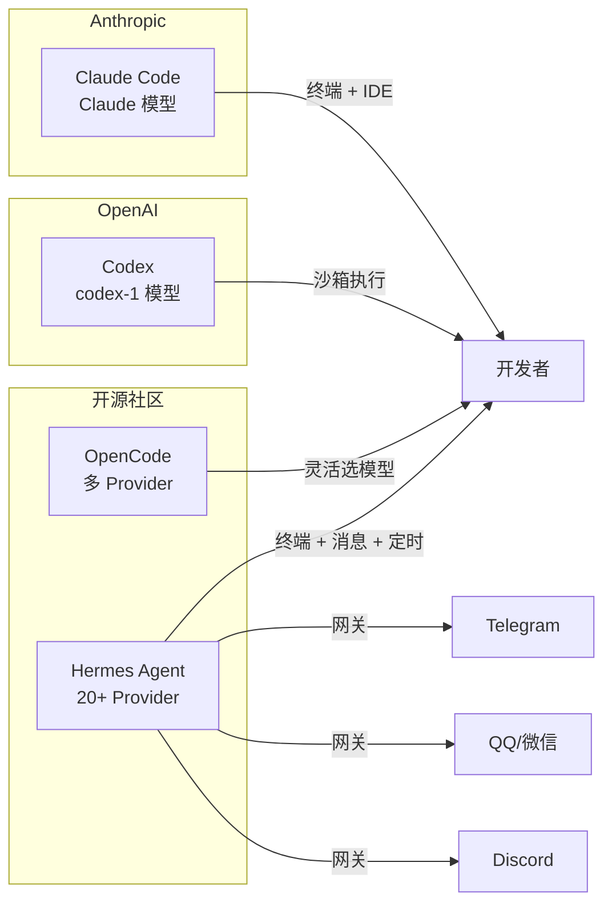

# AI Coding Agent 终极对比：Claude Code vs Codex vs OpenCode vs Hermes Agent

## Coding Agent 是什么

2026 年的开发者工具链里，Coding Agent 已经从"尝鲜玩具"变成了"生产力工具"。和传统的代码补全不同，Coding Agent 能自主读写文件、执行命令、管理 Git 工作流，甚至拆解任务并行执行。你给它一个需求描述，它自己分析代码库、规划实现方案、写代码、跑测试、提交 PR。

我长期使用了五款主流 Coding Agent，这篇文章从架构、功能、使用体验三个维度做深度对比。

## 选手介绍



### Claude Code（Anthropic）

Anthropic 出品的终端 Coding Agent，基于 Claude 模型。核心理念是"一个能在终端里做任何事的 AI"。

- **安装**：`npm install -g @anthropic-ai/claude-code`
- **认证**：OAuth 登录（Pro/Max 订阅）或 API Key
- **运行方式**：交互式 TUI 或 `-p` 非交互模式
- **特色**：CLAUDE.md 项目记忆、子 Agent 编排、Hooks 自动化、MCP 集成

### Codex（OpenAI）

OpenAI 的终端 Coding Agent，基于 codex-1 模型（o3 微调版）。强调"沙箱安全执行"。

- **安装**：`npm install -g @openai/codex`
- **认证**：OpenAI API Key 或 OAuth
- **运行方式**：`codex exec` 一次性执行或交互式 PTY
- **特色**：沙箱隔离、full-auto/yolo 模式、并行 worktree

### OpenCode

开源、Provider 无关的 Coding Agent，支持任意 LLM 后端。类似 Claude Code 但不绑定特定模型。

- **安装**：`npm i -g opencode-ai@latest` 或 `brew install anomalyco/tap/opencode`
- **认证**：支持 OpenRouter、Anthropic、OpenAI 等多个 Provider
- **运行方式**：`opencode run` 一次性执行或 TUI 交互
- **特色**：多 Provider 支持、Session 管理、PR Review、思考过程可见

### Hermes Agent（Nous Research）

开源 AI Agent 框架，不只是 Coding Agent——它是一个全功能的自治代理，支持终端、消息平台、定时任务等。

- **安装**：`curl -fsSL https://raw.githubusercontent.com/NousResearch/hermes-agent/main/scripts/install.sh | bash`
- **认证**：支持 20+ Provider（OpenRouter、Anthropic、DeepSeek、本地模型等）
- **运行方式**：CLI 交互、消息网关（Telegram/Discord/QQ 等）、定时任务
- **特色**：持久记忆、技能系统、多平台网关、子 Agent 编排、Cron 调度

### OpenClaw

轻量级 AI Agent 工具，专注于简洁的配置和快速上手。

- **配置**：Provider 选择 + 技能勾选 + Hooks 开关
- **特色**：极简配置流程、与 Hermes 共享部分基础设施

## 核心能力对比

### 1. 代码理解与生成

| Agent | 上下文理解 | 代码生成质量 | 大规模重构 |
|-------|-----------|-------------|-----------|
| Claude Code | ★★★★★ | ★★★★★ | ★★★★★ |
| Codex | ★★★★ | ★★★★★ | ★★★★ |
| OpenCode | ★★★★ | ★★★★ | ★★★ |
| Hermes Agent | ★★★★ | ★★★★ | ★★★★ |

Claude Code 在理解整个代码库方面是最强的。它的 `/compact` 命令能在上下文快满时智能压缩，保持长时间对话的质量。Codex 的 codex-1 模型（o3 微调）在推理密集型任务上表现突出。OpenCode 和 Hermes 的表现取决于你选择的底层模型。

### 2. 工具调用与系统交互

| Agent | 文件操作 | Shell 命令 | 浏览器 | MCP 支持 |
|-------|---------|-----------|--------|---------|
| Claude Code | ✅ | ✅ | ✅ Chrome | ✅ 原生 |
| Codex | ✅ | ✅ (沙箱) | ❌ | ❌ |
| OpenCode | ✅ | ✅ | ❌ | ❌ |
| Hermes Agent | ✅ | ✅ | ✅ CDP | ✅ 原生 |

Claude Code 和 Hermes 都原生支持 MCP 协议，可以接入 GitHub、数据库、浏览器等外部工具。Codex 的命令执行运行在沙箱中，安全性更高但灵活性受限。

### 3. 会话与记忆

| Agent | Session 持久化 | 跨会话记忆 | 项目上下文 |
|-------|---------------|-----------|-----------|
| Claude Code | ✅ 5小时 | ✅ Auto-Memory | CLAUDE.md |
| Codex | ❌ | ❌ | ❌ |
| OpenCode | ✅ | ❌ | ❌ |
| Hermes Agent | ✅ 永久 | ✅ 持久记忆 | SOUL.md + Skills |

这是差异最大的维度。Claude Code 有 Auto-Memory 机制，会自动把学到的项目知识存在 `~/.claude/projects/` 下。Hermes Agent 更进一步——它有完整的持久记忆系统和技能库，跨会话保留用户偏好、环境信息、操作经验。Codex 和 OpenCode 在这方面相对薄弱。

### 4. 多 Agent 协作

| Agent | 子 Agent | 并行执行 | 编排能力 |
|-------|---------|---------|---------|
| Claude Code | ✅ @agent 语法 | ✅ worktree | ★★★★★ |
| Codex | ❌ | ✅ worktree | ★★★ |
| OpenCode | ❌ | ✅ workdir | ★★ |
| Hermes Agent | ✅ delegate_task | ✅ worktree | ★★★★★ |

Claude Code 和 Hermes 在多 Agent 协作方面最成熟。Claude Code 支持在对话中用 `@agent-name` 调用自定义子 Agent，Hermes 支持 `delegate_task` 拆分任务给独立子进程，还能通过 Kanban 看板做多 Profile 协作。

### 5. 平台集成

| Agent | 终端 | IDE | 消息平台 | 定时任务 |
|-------|------|-----|---------|---------|
| Claude Code | ✅ | ✅ VS Code | ❌ | ❌ |
| Codex | ✅ | ❌ | ❌ | ❌ |
| OpenCode | ✅ | ❌ | ❌ | ❌ |
| Hermes Agent | ✅ | ✅ ACP | ✅ 10+ 平台 | ✅ Cron |

Hermes Agent 的平台覆盖是碾压级的。它不只是一个终端工具——同一个 Agent 能跑在 Telegram、Discord、Slack、QQ、微信等 10 多个消息平台上，还内置了 Cron 定时任务调度。

## 使用场景推荐

### 场景 1：日常写代码

需求：写一个 REST API、加个功能、修个 Bug。

**推荐 Claude Code**。它的 Tab 补全级理解和 `-p` 非交互模式最适合日常编码。写完直接 commit，全程不需要离开终端。

```bash
claude -p "给 UserController 加一个分页查询接口，支持按姓名模糊搜索" --max-turns 10
```

### 场景 2：代码审查

需求：Review 一个 PR 的代码质量。

**推荐 Claude Code 或 OpenCode**。两者都有内置的 PR Review 能力。

```bash
# Claude Code
git diff main...feature | claude -p "Review this diff for bugs and security issues"

# OpenCode
opencode pr 42
```

### 场景 3：跨平台自动化

需求：每天早上在 Telegram 推送 GitHub Issues 摘要，周末自动跑测试。

**推荐 Hermes Agent**。它的 Cron 调度 + 消息网关组合是唯一能实现这个需求的方案。

```bash
hermes cron create "0 9 * * 1-5" --prompt "查看 GitHub Issues 并在 Telegram 推送摘要"
```

### 场景 4：快速原型

需求：快速搭一个 demo 验证想法。

**推荐 Codex**。`codex exec --full-auto` 模式能自动完成从零到一的项目搭建，沙箱隔离保证不影响本地环境。

```bash
codex exec --full-auto "用 FastAPI 搭一个带 JWT 认证的用户管理系统"
```

### 场景 5：开源项目贡献

需求：给一个不熟悉的开源项目提 PR。

**推荐 Claude Code**。它的 CLAUDE.md + Auto-Memory 机制能快速学习项目规范，`--from-pr` 参数直接从 PR 恢复上下文。

```bash
claude --from-pr 123 -p "根据 review 意见修复所有问题"
```

## 定价对比

| Agent | 免费额度 | Pro 价格 | 按量计费 |
|-------|---------|---------|---------|
| Claude Code | 有限 | $20/月（Pro）| API 按 token |
| Codex | 有限 | — | API 按 token |
| OpenCode | 取决于 Provider | — | 取决于 Provider |
| Hermes Agent | 取决于 Provider | — | 取决于 Provider |

Claude Code 的 Pro 订阅包含一定额度的 fast requests，超出后降速。Codex 和 OpenCode 完全按 API 调用计费。Hermes Agent 本身免费开源，费用取决于你选择的 LLM Provider。

## 怎么选

如果你是 **Claude 深度用户**，追求极致的代码理解和重构能力 → **Claude Code**

如果你是 **OpenAI 生态用户**，需要沙箱安全执行 → **Codex**

如果你 **不想绑定某个 Provider**，想用任意模型 → **OpenCode**

如果你需要 **全功能自治代理**——跨平台、持久记忆、定时任务、消息集成 → **Hermes Agent**

如果你只是想 **快速上手试试**，配置越简单越好 → **OpenClaw**

当然，这些工具并不互斥。我自己就是 Claude Code 写代码、Hermes Agent 管自动化、Codex 做快速原型。找到适合自己的组合才是关键。

---

> 工具在快速迭代，半年前的"最佳选择"可能已经被超越。保持开放心态，定期评估新工具，但不要为了追新而频繁切换——深入用好一个工具比浅尝辄止五个更有价值。
