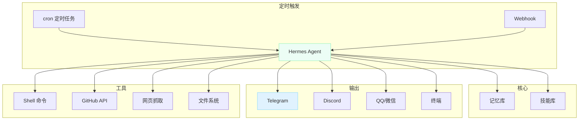
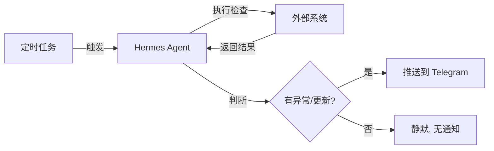

# Hermes Agent 自动化实践：用 AI Agent 做你的数字管家

## 为什么不只是写代码

大多数 AI Coding Agent 解决的问题只有一个——在终端里帮你写代码。但实际工作中，我们需要的远不止写代码：

- 每天早上自动推送 GitHub 通知摘要
- RSS 更新时第一时间推送到手机
- 服务器宕机时自动排查并告警
- 定期检查依赖版本，发现漏洞自动报修

这些需求用传统方式做，你需要 cron + shell 脚本 + 消息推送 + 监控系统，一套组合拳下来比写代码还累。

Hermes Agent 内置了这些能力。这篇文章不讲它是怎么写代码的（上一篇已经讲过了），而是聚焦**自动化**——怎么把 Hermes 当成你的个人助理来用。

## 架构概览



## Cron 定时任务

Hermes 的 cron 系统直接集成在 Agent 中，不需要外部调度器。

### 基本用法

```bash
# 创建一个每天早上 9 点的日报任务
hermes cron create "0 9 * * *" \
  --prompt "检查 GitHub Issues 和 PR 状态，生成摘要报告"
```

也可以使用自然语言描述：

```bash
# 自然语言
hermes cron create "every 2 hours" \
  --prompt "检查服务器磁盘和内存使用情况，异常则推送告警"
```

### 实用的任务示例

**每日 GitHub 动态摘要：**

```bash
hermes cron create "0 8 * * *" \
  --prompt "查看我的 GitHub 仓库中过去 24 小时的 Issues、PR 和 Release，生成简洁的中文摘要。只关注重要的：新的 Issue、被 @ 的、Review 等待中的 PR。"
```

**RSS 订阅检测：**

```bash
hermes cron create "every 30m" \
  --prompt "检查 FreshRSS 中的未读文章，筛选出技术类重要更新，推送标题和链接摘要到 Telegram"
```

**服务器健康巡检：**

```bash
hermes cron create "0 */4 * * *" \
  --prompt "执行以下检查：1) df -h 看磁盘 2) free -h 看内存 3) docker ps 看容器状态。发现异常（磁盘>80%、容器挂了）立即告警"
```

**依赖版本漏洞检查：**

```bash
hermes cron create "0 10 * * 1" \
  --prompt "对 ~/projects 下的主要项目执行 npm audit / pip audit，输出有高危漏洞的依赖清单"
```

### 任务管理

```bash
# 列出所有定时任务
hermes cron list

# 暂停/恢复
hermes cron pause <job_id>
hermes cron resume <job_id>

# 手动触发一次
hermes cron run <job_id>

# 删除
hermes cron remove <job_id>
```

## 消息网关：无处不在的 AI

Hermes 的消息网关（Gateway）可以同时接入多个平台，同一个 AI 实例在不同平台上与你交互。

### 配置网关

```bash
# 交互式配置
hermes gateway setup

# 启动
hermes gateway run

# 后台运行
hermes gateway install
```

配置好之后，你在 Telegram 给它发消息跟在终端里输入效果一样——它能调用工具、读写文件、执行命令。

### 典型场景

**Telegram 个人助理：**
- 发个链接让它总结
- 让它检查某个服务是否在线
- 让它查一下最近的 Git 提交记录

**群聊机器人：**
- 技术群里 @它 问问题
- 自动回复常见问题（配合技能系统）
- 推送项目动态通知

**通知推送器：**
cron 任务产出的结果自动推送到 Telegram，每天早上收到一份精选摘要，而不是自己去刷十几个网站。

## Cron + Gateway 的组合拳

当 cron 任务和消息网关配合使用时，Hermes 就真正变成了一个主动服务：



这种模式下，Hermes 只在**需要你关注的时候**才找你。一切正常时保持安静，不刷屏。

## 写自定义脚本

有些自动化任务需要特殊的逻辑，可以用脚本模式——Hermes 的 cron 支持直接执行脚本，脚本的 stdout 自动作为上下文传递给 Agent：

```bash
# 创建一个监视磁盘的脚本任务
hermes cron create "every 1h" \
  --script ~/.hermes/scripts/disk-watch.sh \
  --prompt "分析输出的磁盘数据，如果有异常就告警"
```

脚本模式的好处是 Agent 不需要自己执行 shell 命令（更快），它只需要分析脚本产出。适合数据采集类的任务。

对于纯脚本任务（不需要 AI 分析），可以用 `no_agent=True` 模式：

```bash
hermes cron create "every 5m" \
  --script ~/.hermes/scripts/ping-check.sh \
  --no-agent \
  --deliver telegram
```

这种模式下脚本的 stdout 会被原样投递，完全不走 LLM，零 Token 消耗。

## 自动化工作流实例

### 实例：信息聚合流水线

```
┌─────────────┐    ┌──────────┐    ┌───────────┐
│ RSSHub      │───→│ FreshRSS │───→│ Hermes    │
│ (抓取无RSS) │    │ (阅读器) │    │ (筛选推送)│
└─────────────┘    └──────────┘    └─────┬─────┘
                                         │
                                    ┌────▼────┐
                                    │Telegram │
                                    │每日摘要  │
                                    └─────────┘
```

在这个流水线中：
1. **RSSHub** 把没有 RSS 的网站转成 RSS
2. **FreshRSS** 统一管理所有订阅
3. **Hermes cron** 定期检查未读，筛选出真正重要的内容
4. **Gateway** 推送到 Telegram

整个流程全自动，你只需要每天早上看一眼推送即可。

### 实例：开发工作流自动化

```
GitHub PR 提交 → Webhook → Hermes Agent
                               │
                    ┌──────────┼──────────┐
                    ▼          ▼          ▼
              自动 Review   运行测试   更新看板
                    │          │          │
                    └──────────┼──────────┘
                              ▼
                       通知结果到 Telegram
```

## 注意事项

1. **Token 消耗**：AI 自动化任务会消耗 Token。高频任务建议用小模型（如 DeepSeek V3），只在需要推理时用大模型。

2. **安全性**：cron 任务中的 Agent 能执行 shell 命令和读写文件——确保任务 prompt 经过验证，不要引入注入风险。

3. **幂等性**：设计任务时确保重复执行不会造成破坏。比如"检查"类任务天然幂等，"创建"类任务需要加判断逻辑。

4. **脚本分离**：复杂的数据处理逻辑建议写成独立脚本，cron 里只做 AI 分析部分。职责分离，便于调试。

## 总结

Hermes Agent 的自动化能力让 AI 从一个被动的对话工具，变成了主动的数字管家。定时任务 + 消息网关 + 技能记忆 这三者的组合，覆盖了个人自动化的大部分需求。

如果你已经在用 Hermes 写代码，不妨试试让它也帮你管管那些重复性的日常事务。配置一次，长期受益。

---

> **提示：** 本文基于 Hermes Agent v0.18.0。定时任务的具体参数和功能可能随版本更新有所变化，以官方文档为准。
