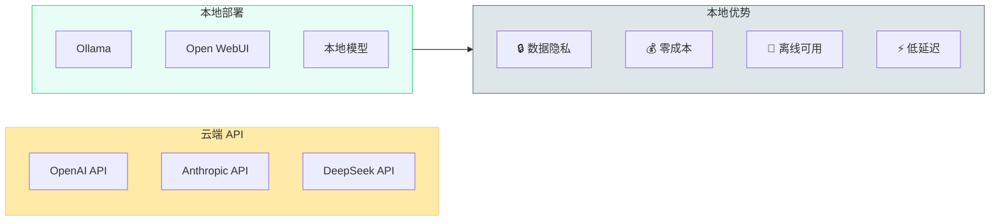

# 本地大模型部署实战：Ollama + Open WebUI

## 为什么要本地部署



云端 API 方便，但有几个绕不开的问题：数据隐私（公司代码不想发到第三方服务器）、成本（大量调用时 API 费用很高）、离线需求（没网的时候也要能用）。本地部署大模型就是为了解决这些问题。

2026 年的开源模型质量已经有了质的飞跃。Llama 3.3、Qwen 2.5、DeepSeek V3、Mistral Large 等模型在很多任务上已经接近甚至超过 GPT-4。配合量化技术，7B 参数的模型在普通笔记本上就能流畅运行。

## Ollama：最简单的本地模型运行方案

Ollama 是目前最简单的本地大模型运行工具。一行命令安装，一行命令跑模型，不需要 CUDA 配置、不需要 Python 环境、不需要理解量化参数。

### 安装

```bash
# Linux / WSL
curl -fsSL https://ollama.ai/install.sh | sh

# macOS
brew install ollama

# Windows
# 从 https://ollama.ai 下载安装包
```

### 下载并运行模型

```bash
# 下载并运行 Llama 3.3 8B
ollama run llama3.3

# 下载并运行 Qwen 2.5 7B
ollama run qwen2.5

# 下载并运行 DeepSeek V3
ollama run deepseek-v3

# 下载并运行 CodeLlama（代码专用）
ollama run codellama
```

第一次运行会自动下载模型文件，之后就是秒启。模型文件存在 `~/.ollama/models/` 下。

### 常用命令

```bash
# 查看已下载的模型
ollama list

# 查看运行中的模型
ollama ps

# 删除模型
ollama rm llama3.3

# 显示模型信息
ollama show llama3.3

# 停止运行中的模型
ollama stop llama3.3
```

### API 调用

Ollama 启动后会自动暴露一个 REST API（默认 `http://localhost:11434`），兼容 OpenAI API 格式：

```bash
# 聊天补全
curl http://localhost:11434/v1/chat/completions \
  -H "Content-Type: application/json" \
  -d '{
    "model": "llama3.3",
    "messages": [{"role": "user", "content": "你好"}]
  }'

# 文本生成
curl http://localhost:11434/api/generate \
  -d '{"model": "llama3.3", "prompt": "写一首关于春天的诗"}'
```

这意味着你可以把 Ollama 当作 OpenAI API 的本地替代品，任何支持 OpenAI API 的工具都能无缝切换。

## Open WebUI：给 Ollama 加个好看的界面

Ollama 本身只有命令行交互，Open WebUI 给它加了一个类似 ChatGPT 的 Web 界面。

### 安装（Docker 方式）

```bash
docker run -d -p 3000:8080 \
  --add-host=host.docker.internal:host-gateway \
  -v open-webui:/app/backend/data \
  --name open-webui \
  --restart always \
  ghcr.io/open-webui/open-webui:main
```

安装完成后访问 `http://localhost:3000`，首次访问需要注册一个管理员账号。

### 连接 Ollama

Open WebUI 会自动检测本地运行的 Ollama 实例。如果没有自动识别，在设置里把 Ollama API 地址填为 `http://host.docker.internal:11434`（Docker 环境）或 `http://localhost:11434`（直接安装）。

### 主要功能

- **多模型切换**：下拉框切换不同模型，对比效果
- **对话管理**：历史对话、文件夹分类、搜索
- **文件上传**：上传 PDF/文档让模型分析
- **RAG**：上传文档建立知识库，模型基于文档回答
- **Prompt 模板**：预设常用 prompt，一键调用
- **多用户**：支持多用户注册，各自独立的对话历史

## 模型选型建议

不同场景推荐不同的模型：

| 场景 | 推荐模型 | 参数量 | 显存需求 |
|------|----------|--------|----------|
| 日常对话 | Qwen 2.5 7B | 7B | 4GB |
| 代码生成 | DeepSeek Coder V2 | 16B | 10GB |
| 通用能力 | Llama 3.3 8B | 8B | 5GB |
| 长文本处理 | Qwen 2.5 32B | 32B | 20GB |
| 复杂推理 | DeepSeek V3 | 671B (MoE) | 需要多卡 |

### 量化版本

显存不够时可以用量化版本。Ollama 默认使用 Q4_K_M 量化，在质量和体积之间取了平衡：

```bash
# Q4 量化（默认，体积小，速度快）
ollama run llama3.3

# Q8 量化（质量更好，体积翻倍）
ollama run llama3.3:8b-q8_0

# FP16 全精度（质量最好，需要更大显存）
ollama run llama3.3:8b-fp16
```

### 没有显卡怎么办

Ollama 支持纯 CPU 运行，只是速度会慢很多。7B 模型在 16GB 内存的笔记本上用 CPU 跑，生成速度大约 5-10 token/s，勉强可用。如果经常用，建议至少配一块 8GB 显存的显卡（RTX 4060 之类的），体验会好很多。

## 进阶：自定义模型

Ollama 支持通过 Modelfile 自定义模型行为：

```dockerfile
# Modelfile
FROM qwen2.5

SYSTEM """
你是一个专业的 Java 后端开发助手。
回答问题时使用中文，代码示例使用 Spring Boot 3.x。
"""

PARAMETER temperature 0.7
PARAMETER num_ctx 4096
```

```bash
# 创建自定义模型
ollama create my-java-assistant -f Modelfile

# 运行
ollama run my-java-assistant
```

这样你就可以针对不同场景创建不同的模型变体，而不需要每次手动输入 system prompt。

## 实际使用体验

我在一台 RTX 4060（8GB 显存）的机器上跑 Qwen 2.5 7B，配合 Open WebUI 日常使用了两个月：

**满意的方面**：响应速度快（首 token 延迟 0.5s 左右），中文能力不错，完全离线可用。用它来做代码解释、写注释、简单重构完全够用。

**不满意的方面**：复杂推理能力还是比不上云端大模型。写长篇代码时容易前后不一致，需要手动修正。另外本地模型的上下文窗口通常比较短（4K-8K），处理长文档时需要分段。

**建议**：把本地模型当作"快速助手"而不是"专家顾问"。简单问题用本地模型秒回，复杂问题再调云端 API。这样既省成本又不牺牲质量。

---

> 本地大模型在 2026 年已经从"玩具"变成了"实用工具"。虽然还不能完全替代云端 API，但在隐私敏感、成本敏感、离线场景下，它是最优解。

---

> **免责声明：** 本文仅供学习交流，不构成任何商业推荐。软件功能、定价等信息可能随版本更新而变化，请以官方最新信息为准。文中涉及的商标、产品名称归各自所有者所有。
