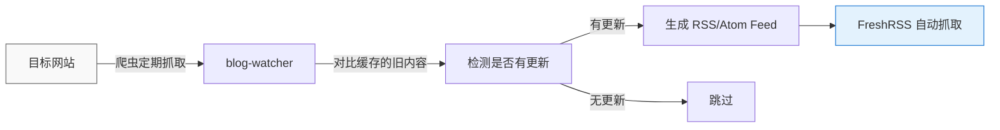
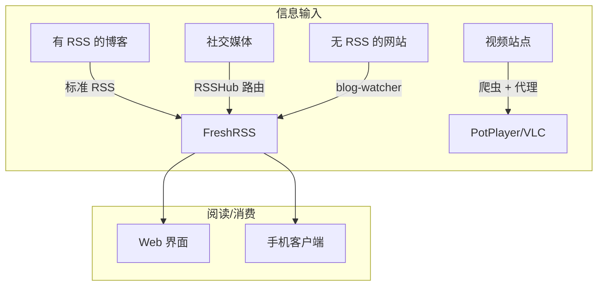

# RSS 自建阅读体系：告别算法，掌握信息流

## 为什么 RSS 在 2026 年仍然重要？

你可能觉得 RSS 是个"过时"的东西——那个 Google Reader 时代的产物。但在 2026 年，RSS 的价值不仅没消失，反而越来越重要。

### 信息消费的困境

今天获取信息的主要渠道：

| 渠道 | 问题 |
|------|------|
| 微信公众号 | 封闭生态，只能看订阅号推送，信息茧房严重 |
| 今日头条/抖音 | 算法推荐，你看到的是平台想让你看到的 |
| 微博/知乎 | 信息流混杂广告，时间线不可控 |
| 邮件订阅 | 邮箱堆满 Newsletter，管理混乱 |

这些平台的核心商业模式是**抢占你的注意力**，而不是帮你**高效获取信息**。算法会刻意推送容易上瘾的、情绪化的内容，而不是你真正需要的。

### RSS 的核心优势

RSS（Really Simple Syndication）的哲学完全不同：**你决定看什么，而不是算法决定**。

1. **去中心化**：不依赖任何平台。就算 Twitter 倒闭了、微信公众号改版了，你的 RSS 订阅列表依然存在。
2. **去算法化**：Feed 里的内容完全按时间排序，没有算法插手的空间。你不会被"猜你喜欢"绑架。
3. **私密**：没有跟踪、没有用户画像、没有广告精准推荐。RSS 阅读器不会把你的阅读习惯卖给广告商。
4. **聚合性**：一个界面看所有关注的博客、新闻、论坛、播客。不用在十几个 App 之间来回切换。
5. **全文获取**：好的 RSS 阅读器能抓取全文，离线阅读。不受原网站改版影响。

### 自建 vs 托管服务

| 维度 | 自建（FreshRSS） | 托管服务（Feedly、Inoreader） |
|------|-----------------|------------------------------|
| 数据主权 | 全部在自己服务器 | 数据在第三方 |
| 费用 | 免费（只花服务器钱） | 免费版有限制，Pro $5-15/月 |
| 隐私 | 完全私有 | 服务商会分析你的阅读习惯 |
| 定制性 | 可装插件、可写扩展 | 固定的功能集 |
| 维护 | 需要自己管 Docker | 不用管 |
| API | 开放 API，可对接其他工具 | 有限制的 API |

如果你已经有了一台服务器（比如 WSL 上的 Docker），自建的成本几乎为零。

## 我的 RSS 基础设施

我目前在 WSL 上通过 Docker 部署了三件套：

```
FreshRSS + RSSHub + blog-watcher
```

### FreshRSS

[FreshRSS](https://freshrss.org/) 是一个开源的、自托管的 RSS 阅读器。它支持：

- 标准的 RSS/Atom 订阅
- 全文抓取（即使源只提供了摘要）
- 标签分类和星标
- 移动端 PWA（可以添加到手机桌面）
- 开放 API（可对接客户端如 NetNewsWire、Fluent Reader）

部署方式（Docker Compose）：

```yaml
services:
  freshrss:
    image: freshrss/freshrss:latest
    container_name: freshrss
    restart: unless-stopped
    ports:
      - "18080:80"
    volumes:
      - ./data:/var/www/FreshRSS/data
      - ./extensions:/var/www/FreshRSS/extensions
    environment:
      CRON_MIN: '*/30'
```

启动后访问 `http://localhost:18080`，设置管理员账号，就可以开始添加订阅了。

### RSSHub

[RSSHub](https://rsshub.app/) 是一个开源的内容聚合器，能把几乎所有网站的内容转为 RSS 格式。它是解决"这个网站没有 RSS"问题的关键。

RSSHub 支持的源类型：

- **社交媒体**：Twitter、微博、B站、知乎、小红书
- **新闻媒体**：多数新闻网站
- **论坛**：V2EX、NGA、贴吧
- **视频平台**：YouTube、B站、抖音
- **博客平台**：Medium、CSDN、博客园

部署也很简单，在同一个 Docker 网络里跑起来：

```yaml
services:
  rsshub:
    image: diygod/rsshub:latest
    container_name: rsshub
    restart: unless-stopped
    ports:
      - "1200:1200"
    environment:
      CACHE_EXPIRE: 600
```

启动后，`http://localhost:1200` 就是你的私有 RSSHub 实例，所有路由规则跟公网版一致。

**典型用法**：

```
# B站 UP 主更新
http://localhost:1200/bilibili/user/video/UP主UID

# 知乎专栏
http://localhost:1200/zhihu/column/专栏ID

# 微博用户
http://localhost:1200/weibo/user/微博UID
```

### blog-watcher

[blog-watcher](https://github.com/shen8614/blog-watcher)（我自己的项目）是一个更底层的手段——当 RSSHub 也覆盖不到某个站点时，直接用爬虫定期抓取页面，提取更新内容，输出 RSS 格式。

它的工作模式：



适用场景：
- 没有 RSS 的博客（纯 HTML 站点）
- 需要登录才能看到内容的页面
- RSSHub 没有提供路由的小众站点
- 需要自定义抓取逻辑的场景

## 如何订阅没有 RSS 的网站？

这是自建 RSS 体系中最核心的能力——**把一切变成 RSS**。

### 方案一：RSSHub 路由（最常用）

对于大多数常见网站，RSSHub 已经提供了现成的路由规则。比如：

```
# B站动态
/rsshub/bilibili/user/dynamic/uid

# YouTube 频道
/rsshub/youtube/channel/UCxxxx

# 小红书笔记
/rsshub/xiaohongshu/user/用户ID

# GitHub Release
/rsshub/github/release/owner/repo
```

### 方案二：RSSHub + 自建路由

如果某个网站比较小众，但结构有规律，可以自己写 RSSHub 路由。RSSHub 的插件系统允许你：

1. 定义一个 URL 模式
2. 写一个抓取和解析逻辑
3. 注册到 RSSHub 实例

这样就能为任何有规律的网页生成 RSS。

### 方案三：blog-watcher 爬虫 RSS

当 RSSHub 不适合时（比如要登录、有反爬、页面结构不规则），用 blog-watcher 自己写爬虫逻辑：

```python
# 示例：抓取某个论坛的最新帖子
def fetch():
    html = requests.get('https://example.com/forum')
    soup = BeautifulSoup(html, 'html.parser')
    posts = []
    for item in soup.select('.post-item'):
        posts.append({
            'title': item.select_one('.title').text,
            'link': item.select_one('a')['href'],
            'date': item.select_one('.date').text,
        })
    return posts
```

自定义脚本注册到 cron，定时产出 RSS Feed，FreshRSS 自动拉取。

### 方案四：直接爬虫 + M3U 输出（音视频源）

对于视频站点，我们之前的做法是把抓到的 m3u8 地址输出成 M3U 播放列表。这个本质上跟 RSS 是一个思路——**把网站内容转成标准的、可被工具消费的格式**。



## 使用技巧

### 文件夹管理

FreshRSS 支持文件夹分类，我的组织方式：

```
📂 技术博客
   ├── 个人博客（阮一峰、酷壳、张鑫旭...）
   ├── 团队博客（Vercel、Netflix Tech、Cloudflare...）
   └── 新闻聚合（Hacker News、Reddit 编程版）

📂 资讯
   ├── 科技媒体（36氪、少数派、InfoQ）
   └── 行业动态

📂 社交动态
   ├── B站关注
   ├── GitHub 关注
   └── 知乎专栏

📂 个人项目
   ├── GitHub Release 通知
   └── CI/CD 状态
```

### 与 Telegram Bot 联动

FreshRSS 配合 Hermes Agent 的 cron 功能，可以定时将未读文章推送到 Telegram，实现"早上看精选摘要"的效果。

### 全文抓取

对于只输出摘要的源，在 FreshRSS 设置中开启"全文抓取"（XPath 配置），或者通过 `post-process` 插件做自定义内容提取。

## 总结

自建 RSS 体系虽然在搭建时需要花一些功夫，但一旦跑起来，带来的信息获取效率提升是革命性的：

- **不再需要每天刷十几个网站**
- **不再被算法牵着走**
- **数据完全属于自己**
- **可定制、可扩展**

对于有 WSL/Docker 环境的开发者来说，FreshRSS + RSSHub + blog-watcher 这套组合拳几乎是"一次部署，终身受益"的投资。

---

> **补充：** 如果你只是偶尔需要订阅一两个没有 RSS 的网站，可以先试试 rsshub.app 的公共服务，不需要自建。当发现不够用的时候，再考虑上自建方案。
